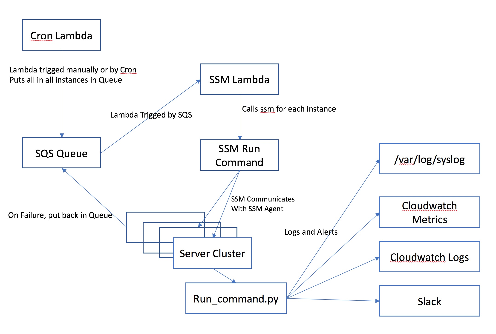

# Command Run

This script will run on a group of instances designated by an autoscaling group.

#### This is the flow as it is now.
1. The lambda kicks gets all the instances under a particular autoscaling group and calls SSM Runcommand for each instance
1. The SSM runcommand runs the run_command.py script on each instance
1. The run_command checks to see if the command is being ran on any other instance
1. If not, it will run the command
1. If so, then it will fail.


#### This would be a better flow with a queue so if it fails, it will try again.
1. The lambda kicks gets all the instances under a particular autoscaling group and calls SSM Runcommand for each instance
1. The SSM runcommand runs the run_command.py script on each instance
1. The run_command checks to see if the command is being ran on any other instance
1. If not, it will run the command
1. If so, then it will fail.


### Before Deployment
You must have AWS keys for the QA account and Prod account and your .aws/conf file setup like this
```
[qa]
aws_access_key_id = XXXXXXXXXXXXXXXXXXXX
aws_secret_access_key = XXXXXXXXXXXXXXXXXXXXXXXXXXXXXXXX
```


## Testing The Run Commmand

The test environment consists of two lambdas.
The command-cron lambda can be a cron lambda or a adhoc lambda which will run a command on a cluster of instances
designated by

### Slack key
You must set your slack key in SSM by running this command

```
aws ssm put-parameter --name SLACK_API_TOKEN  --value {TOKEN} --type String
```

### Lambda Deploy

Note: Make sure your working directory is:
```
/mparticle-homework/
```

To daploy the lambadas run commands

```
lambdas/deploy_lambda.sh command-cron qa {bucketname} {vpc-id} {subnet-id} {availability zone} {internal-subnet-range} {ssh-pem-key-name}

```

### Deploy Test Cluster

To deploy the cluster, run the command

```
./cloudformation/deploy-cloudformation.sh qa test-cluster.yaml test-cluster qa {bucketname} {vpc-id} {subnet-id} {availability zone} {internal-subnet-range} {ssh-pem-key-name}
```


### Running the lambda
This was meant to work with a queue but it hasn't quite gotten there yet. But it will work adhoch with a lambda scheduler